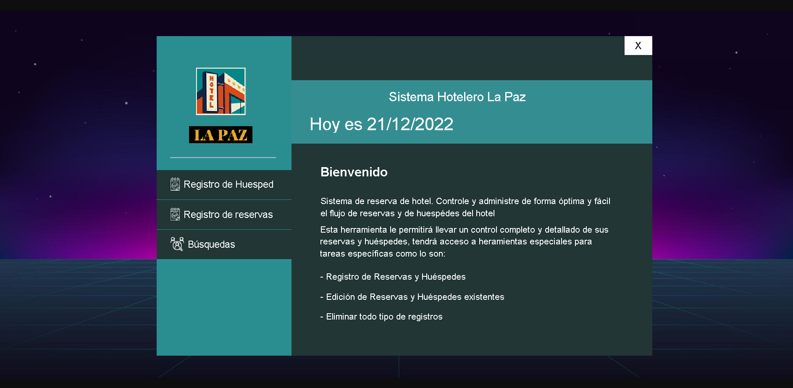
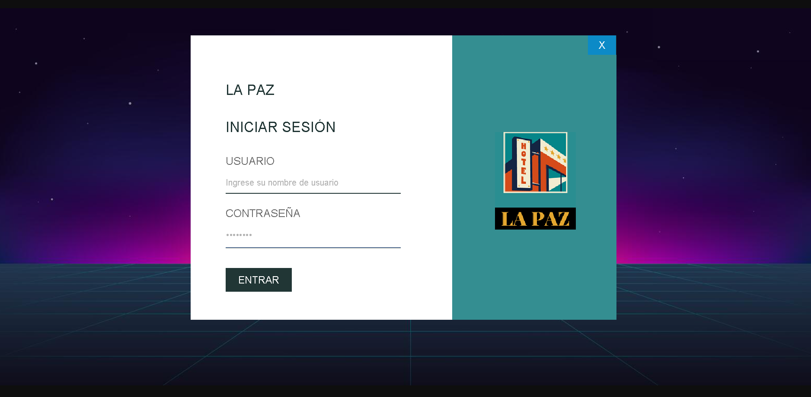
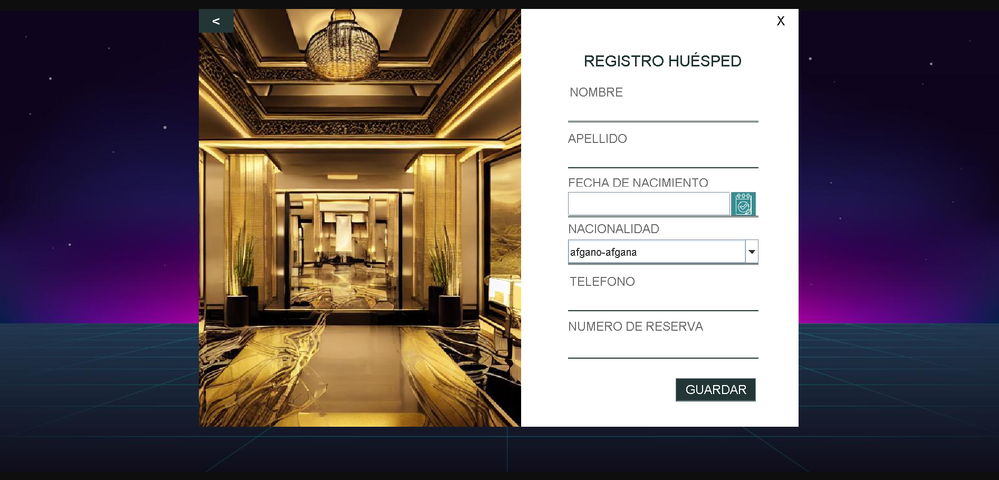
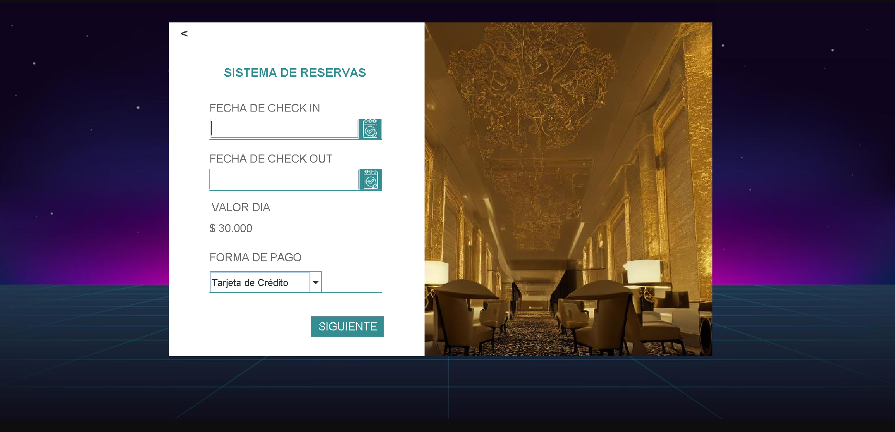
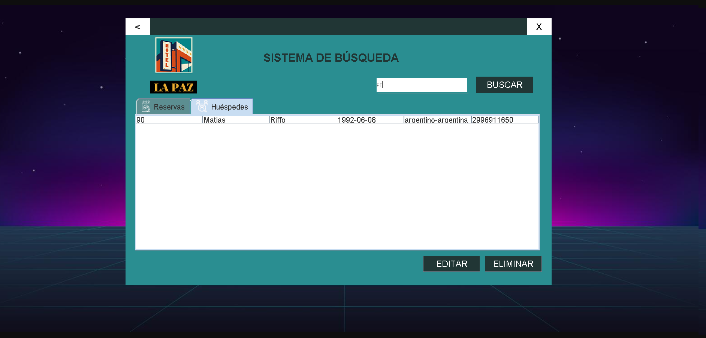

# Challenge ONE | Java | Back-end | Hotel La Paz

  

## 🖥️ Tecnologías Utilizadas:

- Java
- Eclipse
- Biblioteca JCalendar
- MySql
- Plugin WindowBuilder  

---

## 📝 Proyecto Sistema Hotelero - La Paz

## 📬 Inicio de Sesión

   

## 📬 Registro de Huesped y Reservas

   

-

   

## 📊 Banco de Datos

   
